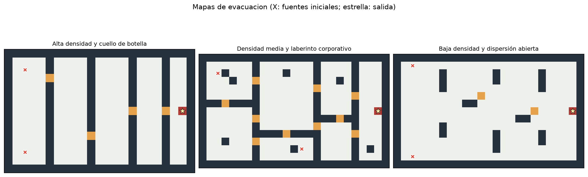
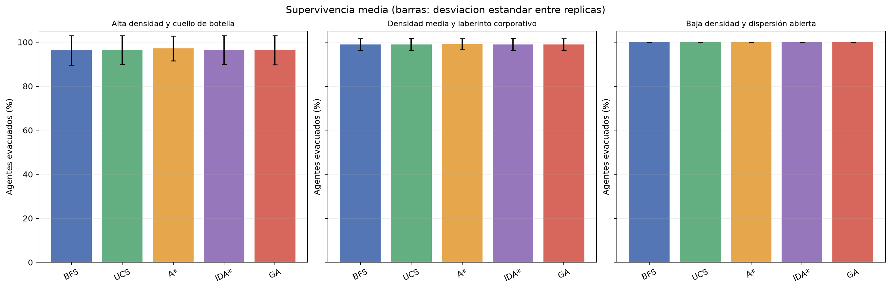

# Tarea 1: Escape de la Torre

Simulador multiagente de evacuación en grillas con obstáculos, cuellos de botella, propagación del fuego, humo y una sola salida por piso.

## Equipo

- Benjamín Alonso Henríquez Cid

## Qué incluye

- **Búsqueda no informada:** BFS y búsqueda de costo uniforme (UCS/Dijkstra).
- **Búsqueda informada:** A* e IDA*, ambos con Manhattan como heurística admisible.
- **Optimización bioinspirada:** algoritmo genético propio (GA) que optimiza rutas considerando ocupación y capacidad.
- Tres mapas definidos en código: alta densidad con puertas estrechas, laberinto corporativo y espacio abierto.
- Benchmark pareado de 200 réplicas por mapa y algoritmo, con resultados crudos, resumen estadístico, figuras e informe.

## Mapas y resultados





## Requisitos

- Python 3.10 o superior.
- NumPy y Matplotlib (se instalan con el proyecto).
- PyTorch es opcional. Con CUDA disponible, el GA puntúa su población de rutas en la GPU; sin PyTorch/CUDA usa NumPy en CPU.

## Instalación y ejecución

Desde la carpeta del repositorio:

```bash
python -m venv .venv
source .venv/bin/activate
python -m pip install -e .
```

Para habilitar la puntuación CUDA del algoritmo genético, instala una versión de PyTorch compatible con tu controlador NVIDIA:

```bash
python -m pip install -e '.[cuda]'
python -c 'import torch; print(torch.cuda.is_available(), torch.cuda.get_device_name(0) if torch.cuda.is_available() else "CPU")'
```

Ejecuta el benchmark completo (3 mapas × 5 algoritmos × 200 réplicas):

```bash
torre-benchmark --iterations 200 --seed 20260927 --device auto
```

El CLI permite cambiar las iteraciones, la semilla, el dispositivo, los mapas, los algoritmos y el directorio de salida:

```bash
torre-benchmark --iterations 80 --seed 20260927 --device cpu
torre-benchmark --iterations 200 --device cuda --maps mapa_1 --algorithms 'A*' GA
```

`auto` elige CUDA si PyTorch la detecta; si no, selecciona CPU. `--device cuda` exige que CUDA esté disponible. El modo GPU acelera la evaluación por lotes de candidatos del GA; las búsquedas clásicas y la lógica de simulación corren en CPU.

## Entregables generados

- `results/raw_runs.csv`: una fila por réplica con semilla, supervivientes, bajas y tiempo de despeje.
- `results/summary.csv`: estadísticos por mapa y algoritmo.
- `results/metadata.json`: parámetros, semilla, dispositivo y entorno.
- `results/maps.png`, `results/survival.png`, `results/clearance.png`: mapas y gráficos del experimento.
- `report/informe.md` y `report/informe.pdf`: informe con métodos, resultados y análisis.

El tiempo de despeje se calcula solo en réplicas con al menos un evacuado y corresponde al turno en que evacúa el último agente. El informe indica cuántas réplicas quedaron fuera de ese estadístico por no evacuar a nadie; esas réplicas siguen incluidas al calcular la supervivencia.

## Modelo y supuestos

Cada corrida modela un piso independiente, de acuerdo con el alcance de un mapa 2D y una salida indicado en el enunciado. Los agentes se ubican aleatoriamente en celdas transitables, se mueven ortogonalmente y esperan cuando la capacidad está ocupada. Los movimientos de cada turno se resuelven priorizando a quienes tienen menos pasos restantes. Las puertas estrechas y la salida tienen capacidad uno; las salas y áreas abiertas, capacidad tres.

La propagación ocurre cada tres turnos. Cada vecino transitable de una celda en llamas se enciende con probabilidad 0.30. Las celdas en llamas y su vecindad ortogonal representan fuego/humo y se consideran peligrosas e intransitables. El costo de entrar a una celda es `1 + 2.4 × (ocupación / capacidad)^2`; todas las aristas cuestan al menos uno.

Las heurísticas Manhattan de A* e IDA* son admisibles porque cada desplazamiento ortogonal acerca al objetivo como máximo una celda y cada paso cuesta al menos uno. El GA usa la misma función de costo como aptitud, con población de 20 individuos y ocho generaciones; no garantiza optimalidad.

## Procedencia y uso de IA

El código de búsqueda y del GA se implementó para esta tarea; no se copió código de repositorios externos. La implementación y redacción recibieron asistencia de ChatGPT (OpenAI, 27-09-2026). Las referencias siguientes respaldan la descripción teórica de los algoritmos.
