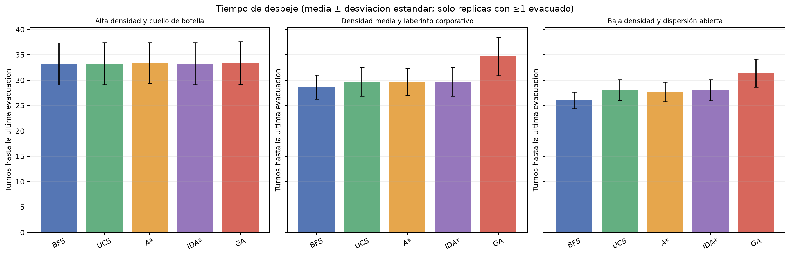

# Tarea 1: Escape de la Torre

**Integrante:** Benjamín Alonso Henríquez Cid 
**Fecha:** 27 de septiembre de 2026 
**Experimento:** 200 réplicas por configuración; 3000 corridas en total. 
**Dispositivo para el GA:** NVIDIA GeForce RTX 2060 SUPER

## 1. Objetivo

Se implementa un sistema de navegación multiagente para evacuar un piso con una sola salida, mientras el fuego se propaga y la ocupación de los pasillos penaliza el movimiento. Se comparan dos búsquedas no informadas, dos informadas y un algoritmo genético propio. La evaluación mide supervivencia y tiempo de despeje, no tiempo de ejecución.

## 2. Entorno y reglas

Cada réplica modela un piso independiente en una grilla bidimensional. Hay una salida por piso y los agentes solo se mueven arriba, abajo, izquierda, derecha o esperan. Las puertas estrechas y la salida tienen capacidad uno; las salas abiertas, capacidad tres. Los conflictos se resuelven dentro del turno, dando prioridad a los agentes con menos pasos restantes hasta la salida.

El fuego avanza cada tres turnos. Cada vecino ortogonal transitable de una casilla en llamas se prende con probabilidad 0.30; la propagación es irreversible. Las casillas en llamas y sus vecinas transitables forman la zona de fuego/humo, que no se puede atravesar. Un agente alcanzado por esa zona es una baja.

El costo de entrar a una celda es `1 + 2.4 × (ocupación / capacidad)^2`. La ocupación se actualiza durante cada turno; un movimiento que no cabe espera y fuerza una nueva planificación. Todas las acciones de movimiento cuestan al menos uno.

Los mapas se definen manualmente en el proyecto. El primero usa cuatro puertas estrechas en serie; el segundo conecta salas mediante puertas y cruces; el tercero conserva varias rutas alternativas con pocos obstáculos.

## 3. Algoritmos

### BFS

Búsqueda en anchura; minimiza cantidad de pasos e ignora congestión.

### UCS

Costo uniforme (Dijkstra); minimiza la suma de costos de celda con congestión.

### A*

Costo uniforme guiado por Manhattan, una cota inferior admisible.

Manhattan es admisible porque cada movimiento ortogonal reduce la distancia al objetivo como máximo en uno y ningún paso puede costar menos de uno.

### IDA*

Profundización iterativa A* con la misma cota Manhattan admisible.

Manhattan es admisible porque cada movimiento ortogonal reduce la distancia al objetivo como máximo en uno y ningún paso puede costar menos de uno.

### GA

Algoritmo genético propio: población de rutas, torneo, cruce por punto común y mutación de segmentos.

Cada individuo codifica una ruta válida como secuencia de celdas. La población inicial combina una ruta de costo uniforme con rutas perturbadas; selección por torneo y elitismo conservan candidatos buenos, el cruce une padres en una celda compartida y la mutación vuelve a buscar un segmento. La aptitud suma los costos de las celdas de destino. Usa 20 individuos y ocho generaciones por planificación. No tiene garantía de optimalidad.
La evaluación por lotes de la población se ejecutó en NVIDIA GeForce RTX 2060 SUPER; el resto de la simulación usa CPU.

## 4. Diseño experimental y métricas

Se usaron 200 réplicas para cada combinación de mapa y algoritmo. La semilla base fue `20260927`; las comparaciones usan las mismas posiciones iniciales y la misma secuencia aleatoria de propagación del fuego dentro de cada mapa/réplica. Las semillas del comportamiento interno de cada algoritmo son independientes.

La supervivencia por réplica es agentes evacuados / agentes iniciales. Se reporta el promedio y la desviación estándar entre réplicas. El tiempo de despeje es el turno en que sale el último agente de una réplica con al menos un evacuado; se reportan media, desviación estándar muestral, mínimo y máximo. Las réplicas sin evacuados no tienen tiempo de despeje definido: se cuentan aparte y no se imputan como cero.

El experimento generó 3000 corridas. La duración de ejecución fue 1678.751 segundos; esta cifra solo documenta el equipo y no es una métrica comparativa.

## 5. Resultados

| Mapa | Algoritmo | Supervivencia media ± DE (%) | Despeje medio ± DE (turnos) | Mín–máx | Replicas con despeje | Sin evacuados |
|---|---|---:|---:|---:|---:|---:|
| Alta densidad y cuello de botella | BFS | 96.3 ± 6.7 | 33.2 ± 4.1 | 20–39 | 200/200 | 0 |
| Alta densidad y cuello de botella | UCS | 96.5 ± 6.5 | 33.2 ± 4.1 | 20–39 | 200/200 | 0 |
| Alta densidad y cuello de botella | A* | 97.2 ± 5.7 | 33.4 ± 4.0 | 20–39 | 200/200 | 0 |
| Alta densidad y cuello de botella | IDA* | 96.5 ± 6.5 | 33.2 ± 4.1 | 20–39 | 200/200 | 0 |
| Alta densidad y cuello de botella | GA | 96.4 ± 6.6 | 33.4 ± 4.2 | 20–39 | 200/200 | 0 |
| Densidad media y laberinto corporativo | BFS | 98.9 ± 2.7 | 28.6 ± 2.4 | 23–41 | 200/200 | 0 |
| Densidad media y laberinto corporativo | UCS | 99.0 ± 2.7 | 29.7 ± 2.8 | 23–41 | 200/200 | 0 |
| Densidad media y laberinto corporativo | A* | 99.1 ± 2.5 | 29.7 ± 2.7 | 23–39 | 200/200 | 0 |
| Densidad media y laberinto corporativo | IDA* | 99.0 ± 2.7 | 29.7 ± 2.8 | 23–41 | 200/200 | 0 |
| Densidad media y laberinto corporativo | GA | 99.0 ± 2.6 | 34.7 ± 3.8 | 25–47 | 200/200 | 0 |
| Baja densidad y dispersión abierta | BFS | 100.0 ± 0.0 | 26.0 ± 1.6 | 20–31 | 200/200 | 0 |
| Baja densidad y dispersión abierta | UCS | 100.0 ± 0.0 | 28.0 ± 2.0 | 20–33 | 200/200 | 0 |
| Baja densidad y dispersión abierta | A* | 100.0 ± 0.0 | 27.7 ± 1.9 | 20–33 | 200/200 | 0 |
| Baja densidad y dispersión abierta | IDA* | 100.0 ± 0.0 | 28.0 ± 2.1 | 20–33 | 200/200 | 0 |
| Baja densidad y dispersión abierta | GA | 100.0 ± 0.0 | 31.4 ± 2.8 | 21–38 | 200/200 | 0 |

La desviación estándar de supervivencia está expresada en puntos porcentuales. Para el despeje, la estadística usa solamente réplicas con al menos un evacuado; la tabla permite ver el tamaño efectivo de esa muestra. Los datos por réplica están en `results/raw_runs.csv`, y las tablas consolidadas en `results/summary.csv`.

## 6. Análisis

En **Alta densidad y cuello de botella**, la mayor supervivencia media fue de **A*** (97.2%). El menor despeje medio entre réplicas válidas fue de **BFS** (33.2 turnos; 200/200 réplicas válidas).

En **Densidad media y laberinto corporativo**, la mayor supervivencia media fue de **A*** (99.1%). El menor despeje medio entre réplicas válidas fue de **BFS** (28.6 turnos; 200/200 réplicas válidas).

En **Baja densidad y dispersión abierta**, la mayor supervivencia media fue de **BFS** (100.0%). El menor despeje medio entre réplicas válidas fue de **BFS** (26.0 turnos; 200/200 réplicas válidas).

Las diferencias se interpretan bajo este simulador y sus parámetros; no se extrapolan a edificios reales. La desviación estándar describe la variabilidad observada y no reemplaza una prueba de significancia. La salida de capacidad uno crea un cuello de botella común en los tres mapas, mientras que la geometría y la cantidad de agentes distinguen la dificultad topológica.

## 7. Conclusiones

La comparación separa la influencia de la congestión en la planificación de rutas: BFS prioriza pasos, UCS y los métodos informados consideran costos de ocupación, e IDA* permite resolver el mismo objetivo con una estrategia de memoria acotada. El GA busca buenas rutas por población y mutación, pero no garantiza el óptimo. Los resultados por mapa muestran cómo capacidad, densidad y propagación del fuego cambian supervivencia y despeje.

## 8. Limitaciones

- El movimiento de una persona se abstrae a una celda y no modela velocidad, caídas, visibilidad ni decisiones humanas.
- El fuego usa una probabilidad uniforme por vecino; no incorpora materiales, viento ni ventilación.
- La zona de humo es una vecindad ortogonal estática alrededor del fuego, no una simulación física de humo.
- Cada corrida considera un piso y una única salida, como acota la evaluación del enunciado.
- El GA es estocástico y su calidad depende del tamaño de población, generaciones y operadores elegidos.

## 9. Referencias y asistencia de IA

- Dijkstra, E. W. (1959). A note on two problems in connexion with graphs. *Numerische Mathematik*, 1, 269–271. https://doi.org/10.1007/BF01386390
- Hart, P. E., Nilsson, N. J., & Raphael, B. (1968). A formal basis for the heuristic determination of minimum cost paths. *IEEE Transactions on Systems Science and Cybernetics*, 4(2), 100–107. https://doi.org/10.1109/TSSC.1968.300136
- Korf, R. E. (1985). Depth-first iterative-deepening: An optimal admissible tree search. *Artificial Intelligence*, 27(1), 97–109. https://doi.org/10.1016/0004-3702(85)90084-0
- Holland, J. H. (1975). *Adaptation in Natural and Artificial Systems*. University of Michigan Press.
- OpenAI. (2026). ChatGPT, asistencia generativa para implementación, revisión y redacción del proyecto, 27 de septiembre de 2026.

No se incorporó código copiado de repositorios externos.
